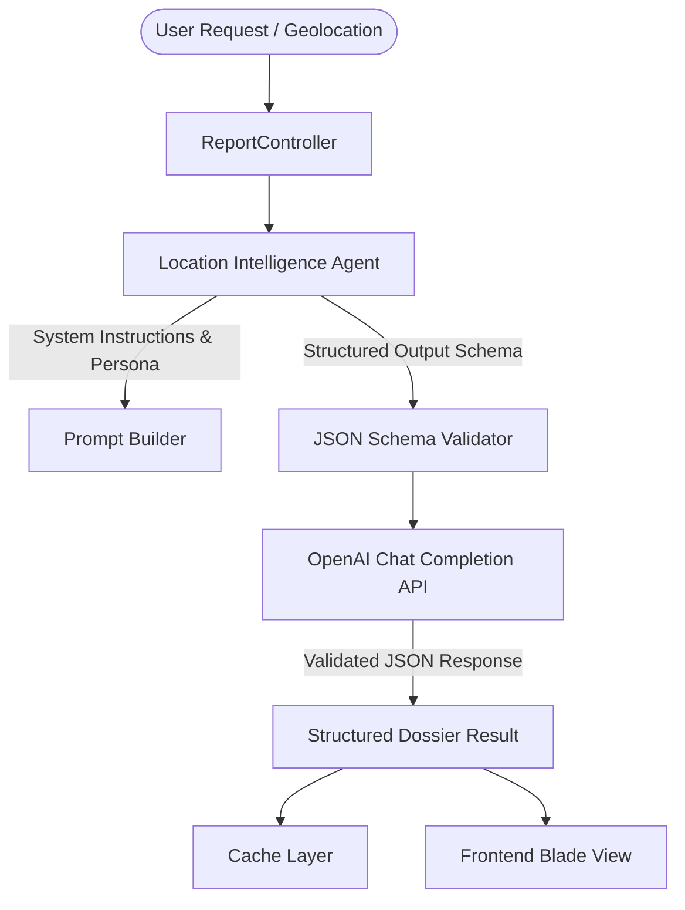
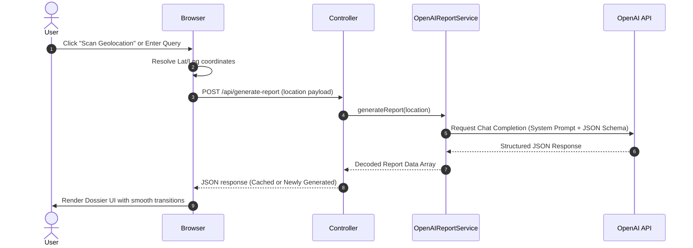

# PlacePulse AI — Agentic Architecture & Specifications (AGENTS.md)

PlacePulse AI is designed around agentic engineering principles, leveraging both **design-time development agents** and **runtime intelligence agents** to deliver structured location dossiers. This document outlines the agent personas, system architectures, workflows, and tools that govern the execution of PlacePulse AI.

---

## 1. Runtime Agent: The Location Intelligence Dossier Agent

At runtime, PlacePulse AI orchestrates a specialized agent powered by OpenAI models (e.g., `gpt-5-mini`) to analyze geolocations, synthesize cultural history, compile travel guidelines, and structure complex JSON payloads.

### Agent Persona & System Instructions

- **Agent Name**: `PlacePulse Intelligence Agent`
- **Role**: World-class travel writer, cultural anthropologist, and historical guide.
- **Tone**: Poetic, specific, vivid, and highly structured (strictly emoji-free).
- **Core Instruction Set**:
    - Uncover lesser-known local stories rather than generic tourist highlights.
    - Formulate precise, actionable practical guidelines.
    - Maintain absolute compliance with the defined JSON response schema.

---

## 2. Design-Time Agent: Codex

This project's code, structure, and user interfaces were co-engineered using **Codex**, a state-of-the-art agentic pair programmer.

### Agentic Collaborative Development Workflow

1. **Interactive Planning Phase**: Refined user interface requirements, verified color palettes (such as `primary-600`), and resolved PDF layout limitations.
2. **Context-Aware Implementation**: Analyzed the workspace codebase, performed code changes using precise tools, and compiled assets via Vite builds.
3. **Automated Verification**: Ran Laravel builds and verified style sheets to ensure perfect consistency.

---

## 3. Agent Workflow Orchestration

The report generation workflow relies on structured input processing and validation:

---

## 4. Agent Configuration & Environment

The runtime agent properties are defined in the application configuration:

| Parameter            | Configuration Key       | Default Value | Description                                                             |
| -------------------- | ----------------------- | ------------- | ----------------------------------------------------------------------- |
| **Model**            | `openai.model`          | `gpt-5-mini`  | The OpenAI model executing the agent analysis.                          |
| **Strict Schema**    | `response_format`       | `json_schema` | Enforces structured outputs on the OpenAI endpoint.                     |
| **Token Limit**      | `max_completion_tokens` | `8000`        | Completion budget for structured JSON (reasoning models need headroom). |
| **Reasoning Effort** | `reasoning_effort`      | `low`         | Reduces internal reasoning token use so output is not truncated.        |

For detailed information on the tools and skills utilized by the agents, please refer to [skills.md](skills.md).
