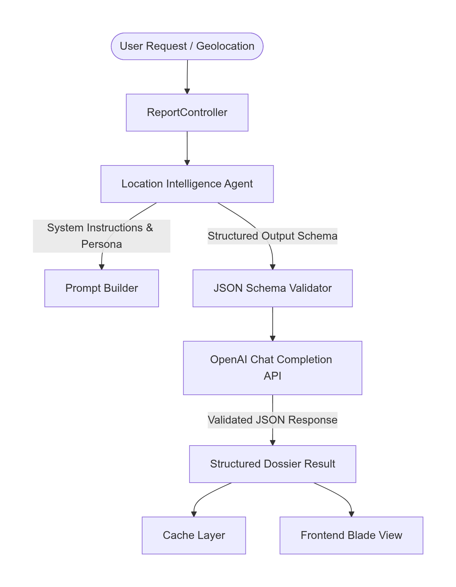
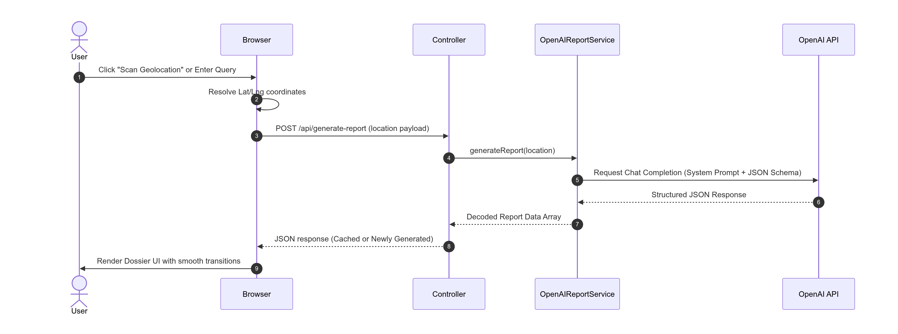

# PlacePulse AI

**One-click instant deep-dive location reports powered by OpenAI.**

PlacePulse AI turns any place into a structured cultural intelligence dossier. Scan your coordinates or search manually — the Location Intelligence Agent synthesizes history, must-visit spots, local flavors, practical tips, and fun facts into a polished, scrollable report you can save and export as PDF.

Built for the **Codex Community Challenge** with agenticdevelopment patterns ([AGENTS.md](AGENTS.md), [skills.md](skills.md)) and meaningful OpenAI platform integration.

## Table of Contents

- [PlacePulse AI](#placepulse-ai)
  - [Table of Contents](#table-of-contents)
  - [Demo](#demo)
    - [Live Demo Link](#live-demo-link)
    - [Recorded Demo Video](#recorded-demo-video)
  - [Features](#features)
  - [Tech Stack](#tech-stack)
  - [Requirements](#requirements)
  - [Running Locally](#running-locally)
    - [1. Clone the repository](#1-clone-the-repository)
    - [2. One-command setup](#2-one-command-setup)
    - [3. Configure environment](#3-configure-environment)
    - [4. Start the application](#4-start-the-application)
    - [5. Open in browser](#5-open-in-browser)
  - [Manual setup (alternative)](#manual-setup-alternative)
  - [How to Use](#how-to-use)
  - [Screenshots](#screenshots)
  - [Problem \& Impact](#problem--impact)
    - [What problem does the project solve?](#what-problem-does-the-project-solve)
    - [Who benefits?](#who-benefits)
    - [What is the potential impact?](#what-is-the-potential-impact)
  - [OpenAI Integration](#openai-integration)
    - [Model \& API](#model--api)
    - [Why structured outputs?](#why-structured-outputs)
    - [Why reasoning effort tuning?](#why-reasoning-effort-tuning)
    - [How was OpenAI integrated into the solution?](#how-was-openai-integrated-into-the-solution)
    - [Agentic development](#agentic-development)
    - [Architecture](#architecture)
    - [Agentic development](#agentic-development-1)
  - [Project Structure](#project-structure)
  - [Author](#author)

## Demo

### Live Demo Link

**Live Site:** https://placepulse-ai.onrender.com

(**Note:** The demo is hosted on Render's free tier and may take a while to load on the first request due to cold starts.)

### Recorded Demo Video

https://www.loom.com/share/96c11e96a6184cbf82c1b512bf94eb0e

## Features

| Feature                     | Description                                                                                                 |
| --------------------------- | ----------------------------------------------------------------------------------------------------------- |
| **Scan Geolocation**        | Browser GPS → reverse geocode (English, district + country) → instant report                                |
| **Manual search**           | Enter any city, district, landmark, or region                                                               |
| **AI location dossier**     | 8 structured sections: title, subtitle, soul narrative, history, must-visit, local flavors, tips, fun facts |
| **Structured JSON outputs** | Strict OpenAI `json_schema` — every field validated before render                                           |
| **Report caching**          | Database-backed cache avoids repeat API calls for the same query                                            |
| **Regenerate**              | Force a fresh AI analysis on demand                                                                         |
| **PDF export**              | Download a formatted intelligence dossier                                                                   |
| **User accounts**           | Register/login to persist report history                                                                    |
| **Dark mode**               | System-aware toggle with local persistence                                                                  |
| **Responsive UI**           | Tailwind CSS 4, mobile-first layout                                                                         |

## Tech Stack

- **Backend:** Laravel 13, PHP 8.3+
- **Frontend:** Blade, Tailwind CSS 4, Vite
- **AI:** OpenAI Chat Completions (`gpt-5-mini`) via `openai-php/laravel`
- **Geocoding:** OpenStreetMap Nominatim (no API key required)
- **Database:** SQLite
- **Cache:** Redis
- **PDF:** DomPDF

## Requirements

- PHP **8.3+** locally · **8.4** in Docker (Render)
- PHP extensions (local): `sqlite3`, `pdo_sqlite`, `mbstring`, `openssl`, `curl`
- [Composer](https://getcomposer.org/)
- [Node.js](https://nodejs.org/) 18+ and npm
- An [OpenAI API key](https://platform.openai.com/api-keys)

## Running Locally

### 1. Clone the repository

```bash
git clone https://github.com/Atia-Farha/PlacePulse-AI.git
cd PlacePulse-AI
```

### 2. One-command setup

```bash
composer setup
```

This installs PHP dependencies, creates `.env`, generates an app key, runs migrations, installs npm packages, and builds frontend assets.

### 3. Configure environment

Open `.env` and set your OpenAI credentials:

```env
APP_NAME="PlacePulse AI"
OPENAI_API_KEY=sk-your-key-here
OPENAI_MODEL=gpt-5-mini
OPENAI_MAX_COMPLETION_TOKENS=8000
OPENAI_REASONING_EFFORT=low
```

Ensure SQLite is ready (usually created automatically):

```bash
touch database/database.sqlite
php artisan migrate
```

### 4. Start the application

**Option A — development (hot reload for CSS/JS):**

```bash
composer dev
```

Starts the Laravel server, Vite, queue worker, and log tail concurrently.

**Option B — simple server (after `npm run build`):**

```bash
php artisan serve
```

### 5. Open in browser

Visit **[http://127.0.0.1:8000](http://127.0.0.1:8000)**

## Manual setup (alternative)

```bash
composer install
cp .env.example .env
php artisan key:generate
touch database/database.sqlite
php artisan migrate
npm install
npm run build
php artisan serve
```

## How to Use

1. Click **Scan Geolocation** (allow location permission), or type a place and submit.
2. Wait ~30–60 seconds while the Location Intelligence Agent generates the dossier.
3. Click **Regenerate** to force a fresh AI analysis on demand.
4. Click **Download PDF** to download a formatted intelligence dossier.
5. Optionally, register an account to save history.

## Screenshots


## Problem & Impact

### What problem does the project solve?

Travel and local discovery content is scattered, generic, or shallow. Getting a rich, structured picture of a place — its history, culture, food, and practical advice — usually requires hours of research across multiple sources.

### Who benefits?

- **Travelers** exploring unfamiliar cities or districts
- **Students and Researchers** needing quick cultural context
- **Remote Workers** relocating or visiting new areas
- **Local Communities** rediscovering their own region through AI-curated narratives

### What is the potential impact?

PlacePulse AI democratizes location intelligence: one click or one search produces a magazine-quality dossier that would be impractical to assemble manually. It is especially valuable for lesser-known districts where mainstream travel guides offer little depth.

**Category fit:** Creative Applications, Education & Learning, Local Problem Solving, AI Agents.

## OpenAI Integration

PlacePulse AI uses OpenAI as the **core intelligence layer** — not as a bolt-on chat widget.

### Model & API

| Setting               | Value                                     |
| --------------------- | ----------------------------------------- |
| Model                 | `gpt-5-mini`                              |
| Endpoint              | Chat Completions                          |
| Response format       | Strict `json_schema` (structured outputs) |
| Max completion tokens | `8000`                                    |
| Reasoning effort      | `low`                                     |
| SDK                   | `openai-php/laravel`                      |

### Why structured outputs?

Reports must render reliably in Blade templates and PDF exports. A strict JSON schema guarantees every section (`title`, `subtitle`, `soul`, `history`, `must_visit`, `local_flavors`, `practical_tips`, `fun_facts`) is present and typed correctly — no fragile markdown parsing.

### Why reasoning effort tuning?

`gpt-5-mini` is a reasoning model. Internal reasoning tokens count against the completion budget. With the default 4000-token limit, the model could exhaust its budget on reasoning and return empty content. Setting `reasoning_effort=low` and `max_completion_tokens=8000` ensures the full dossier is generated.

### How was OpenAI integrated into the solution?

1. **Input:** User provides a location via browser geolocation (reverse-geocoded to English district + country) or manual text search.
2. **Agent invocation:** `OpenAIReportService` sends a system prompt defining the **PlacePulse Intelligence Agent** persona (travel writer, cultural anthropologist, historian) plus the user's location.
3. **Structured output:** OpenAI returns a strict JSON object with eight required sections: `title`, `subtitle`, `soul`, `history`, `must_visit`, `local_flavors`, `practical_tips`, `fun_facts`.
4. **Validation & cache:** JSON is parsed and validated; results are stored in SQLite to avoid duplicate API calls.
5. **Delivery:** Laravel renders the dossier in a responsive Blade UI and supports PDF export via DomPDF.

### Agentic development

| Artifact     | Role                                                                                             |
| ------------ | ------------------------------------------------------------------------------------------------ |
| `AGENTS.md`  | Documents runtime Location Intelligence Agent architecture, Mermaid workflows, and configuration |
| `skills.md`  | Defines geocoding, structured dossier synthesis, PDF layout, and UI skills                       |
| Codex agents | Co-engineered the Laravel app using agentic pair programming patterns                            |

### Architecture





See [AGENTS.md](./AGENTS.md) for the runtime agent persona, workflow diagrams, and configuration reference.  
See [skills.md](./skills.md) for geocoding, schema synthesis, and design-time agent capabilities.

### Agentic development

| Artifact     | Role                                                                                             |
| ------------ | ------------------------------------------------------------------------------------------------ |
| `AGENTS.md`  | Documents runtime Location Intelligence Agent architecture, Mermaid workflows, and configuration |
| `skills.md`  | Defines geocoding, structured dossier synthesis, PDF layout, and UI skills                       |
| Codex agents | Co-engineered the Laravel app using agentic pair programming patterns                            |

## Project Structure

```
app/
├── Http/Controllers/
│   ├── ReportController.php      # Report generation, geocoding, PDF
│   ├── AuthController.php        # Login / register
│   └── HistoryController.php     # Saved reports
├── Services/
│   └── OpenAIReportService.php   # OpenAI agent + JSON schema
resources/
├── js/app.js                     # Geolocation, report UI, API calls
├── views/                        # Blade templates
config/openai.php                 # Model, tokens, reasoning effort
Dockerfile                        # Production container (Render)
render.yaml                       # Render Blueprint (free tier)
docker/render-start.sh            # Migrate, cache, serve
AGENTS.md                         # Agent architecture (Codex challenge)
skills.md                         # Agent capabilities (Codex challenge)
```

## Author

Developed by Atia Farha ([@atia-farha](https://github.com/atia-farha))
