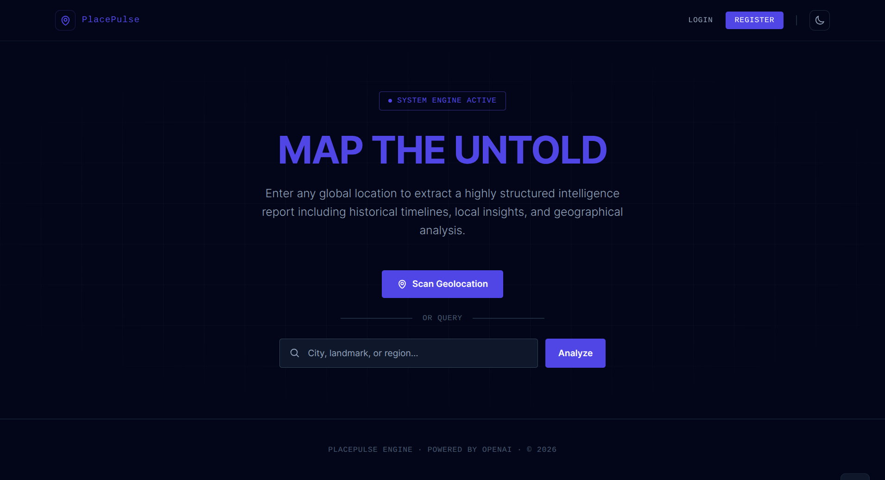
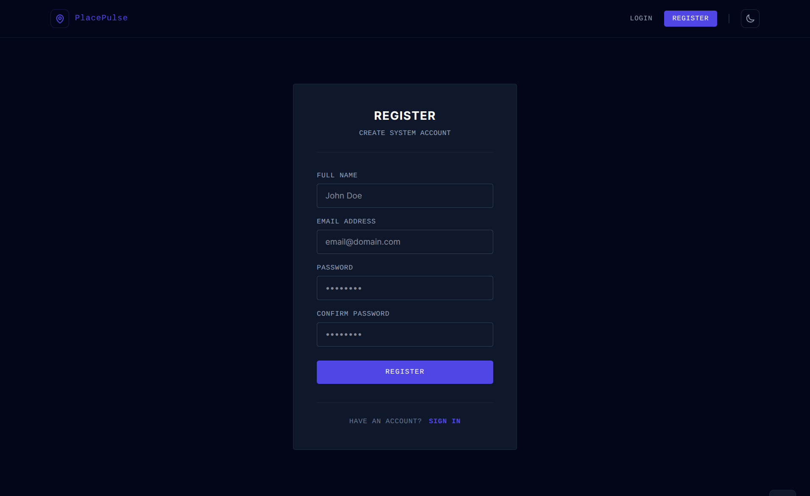
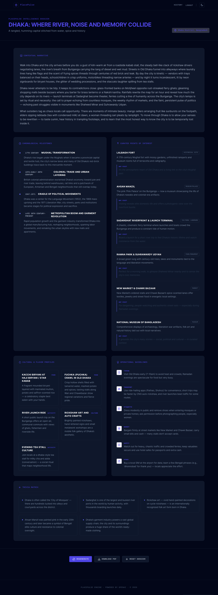
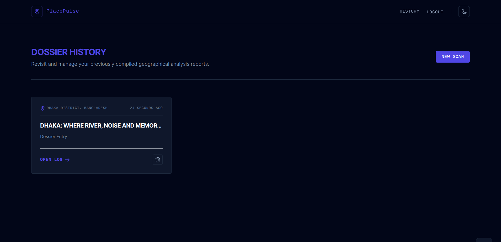

# PlacePulse AI — Codex Community Challenge Submission

## Project Information

### Project Name

PlacePulse AI
- [PlacePulse AI — Codex Community Challenge Submission](#placepulse-ai--codex-community-challenge-submission)
  - [Project Information](#project-information)
    - [Project Name](#project-name)
    - [Short Project Description](#short-project-description)
    - [Source Code](#source-code)
  - [Project Demo](#project-demo)
    - [Live Demo Link](#live-demo-link)
    - [Recorded Demo Video](#recorded-demo-video)
  - [OpenAI Usage Details](#openai-usage-details)
    - [Which OpenAI models, APIs, or platform features were used?](#which-openai-models-apis-or-platform-features-were-used)
    - [How was OpenAI integrated into the solution?](#how-was-openai-integrated-into-the-solution)
    - [Why were these capabilities chosen?](#why-were-these-capabilities-chosen)
    - [Agentic development](#agentic-development)
  - [Problem \& Impact](#problem--impact)
    - [What problem does the project solve?](#what-problem-does-the-project-solve)
    - [Who benefits?](#who-benefits)
    - [What is the potential impact?](#what-is-the-potential-impact)
  - [Social Post](#social-post)
    - [LinkedIn draft](#linkedin-draft)
  - [Screenshots](#screenshots)
  - [Creativity \& Innovation](#creativity--innovation)
  - [Effective Use of Codex \& OpenAI Platform](#effective-use-of-codex--openai-platform)
  - [Technical Execution](#technical-execution)
  - [Real-World Impact](#real-world-impact)


### Short Project Description

One-click AI location intelligence. Scan your coordinates or search any place to receive a structured cultural dossier — hidden history, must-visit spots, local flavors, practical travel tips, and fun facts — powered by OpenAI structured outputs and agentic development workflows.

### Source Code

https://github.com/Atia-Farha/PlacePulse-AI

## Project Demo

### Live Demo Link

**Live Site:** https://placepulse-ai.onrender.com

(**Note:** The demo is hosted on Render's free tier and may take a while to load on the first request due to cold starts.)

**Local Fallback**:

```bash
git clone https://github.com/Atia-Farha/PlacePulse-AI.git
cd PlacePulse-AI
composer setup
# Add OPENAI_API_KEY to .env
php artisan serve
# Open http://127.0.0.1:8000
```

Full instructions: [README.md](https://github.com/Atia-Farha/PlacePulse-AI/blob/main/README.md))

### Recorded Demo Video


## OpenAI Usage Details

### Which OpenAI models, APIs, or platform features were used?

| Setting               | Value                                     |
| --------------------- | ----------------------------------------- |
| Model                 | `gpt-5-mini`                              |
| Endpoint              | Chat Completions (`/v1/chat/completions`)                          |
| Response format       | Strict `json_schema` (structured outputs) |
| Max completion tokens | `8000`                                    |
| Reasoning effort      | `low`                                     |
| SDK                   | `openai-php/laravel`                      |

### How was OpenAI integrated into the solution?

1. **Input:** User provides a location via browser geolocation (reverse-geocoded to English district + country) or manual text search.
2. **Agent invocation:** `OpenAIReportService` sends a system prompt defining the **PlacePulse Intelligence Agent** persona (travel writer, cultural anthropologist, historian) plus the user's location.
3. **Structured output:** OpenAI returns a strict JSON object with eight required sections: `title`, `subtitle`, `soul`, `history`, `must_visit`, `local_flavors`, `practical_tips`, `fun_facts`.
4. **Validation & cache:** JSON is parsed and validated; results are stored in SQLite to avoid duplicate API calls.
5. **Delivery:** Laravel renders the dossier in a responsive Blade UI and supports PDF export via DomPDF.

### Why were these capabilities chosen?

| Choice                    | Reason                                                                                                |
| ------------------------- | ----------------------------------------------------------------------------------------------------- |
| `gpt-5-mini`              | Strong long-form synthesis at reasonable cost for hackathon-scale usage                               |
| Strict JSON schema        | Guarantees parseable, UI-ready output every time — no regex on free-form markdown                     |
| `reasoning_effort: low`   | Reasoning models spend tokens on internal thinking; lowering effort leaves budget for the full report |
| Higher token limit (8000) | Prevents empty responses when reasoning consumes the completion budget                                |
| System prompt persona     | Produces vivid, non-generic travel writing with fresh historical angles                               |

### Agentic development

| Artifact              | Role                                                                                             |
| --------------------- | ------------------------------------------------------------------------------------------------ |
| `AGENTS.md`           | Documents runtime Location Intelligence Agent architecture, Mermaid workflows, and configuration |
| `skills.md`           | Defines geocoding, structured dossier synthesis, PDF layout, and UI skills                       |
| Codex agents | Co-engineered the Laravel app using agentic pair programming patterns                            |

## Problem & Impact

### What problem does the project solve?

Travel and local discovery content is scattered, generic, or shallow. Getting a rich, structured picture of a place — its history, culture, food, and practical advice — usually requires hours of research across multiple sources.

### Who benefits?

- **Travelers** exploring unfamiliar cities or districts
- **Students and Researchers** needing quick cultural context
- **Remote Workers** relocating or visiting new areas
- **Local Communities** rediscovering their own region through AI-curated narratives

### What is the potential impact?

PlacePulse AI democratizes location intelligence: one click or one search produces a magazine-quality dossier that would be impractical to assemble manually. It is especially valuable for lesser-known districts where mainstream travel guides offer little depth.

**Category fit:** Creative Applications, Education & Learning, Local Problem Solving, AI Agents.

## Social Post

### LinkedIn draft

```
I built PlacePulse AI for the Codex Community Challenge.

One click → scan your location → get an AI-generated cultural dossier:
• Hidden history & untold stories
• Must-visit spots
• Local flavors & experiences
• Practical travel tips

Powered by OpenAI gpt-5-mini with strict JSON schema structured outputs.
Built with Laravel, Tailwind, agentic workflows (AGENTS.md + skills.md), and Codex.

No live deploy — run locally in 5 minutes or use Render Blueprint:
https://github.com/Atia-Farha/PlacePulse-AI#deploy-on-render-free-tier

[Add demo video link when ready]

#OpenAI #CodexCommunity #AIAgents #BuildInPublic #Laravel
```

## Screenshots










## Creativity & Innovation

- Original concept: not a chatbot — a one-click **location intelligence dossier**
- Fresh AI angles on history and culture, not Wikipedia summaries
- Geolocation → district-level detection → instant deep-dive report

## Effective Use of Codex & OpenAI Platform

- Core product depends on OpenAI structured outputs
- Documented agent architecture in `AGENTS.md` and `skills.md`
- Reasoning model tuning (`reasoning_effort`, token budget) shows platform-aware engineering

## Technical Execution

- Full-stack Laravel app: auth, caching, PDF, responsive UI, dark mode
- Reliable JSON schema pipeline with error handling and logging
- English geocoding with district + country formatting

## Real-World Impact

- Practical value for travelers, students, and local discovery
- Works globally; tuned for accurate district-level auto-detection
